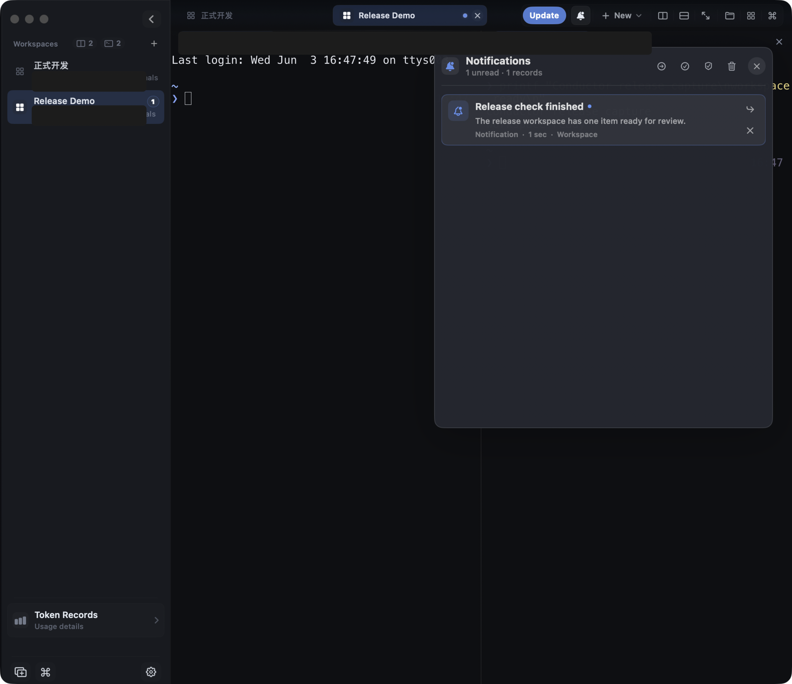
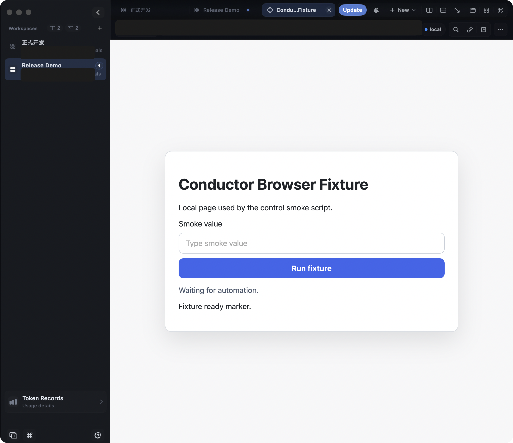
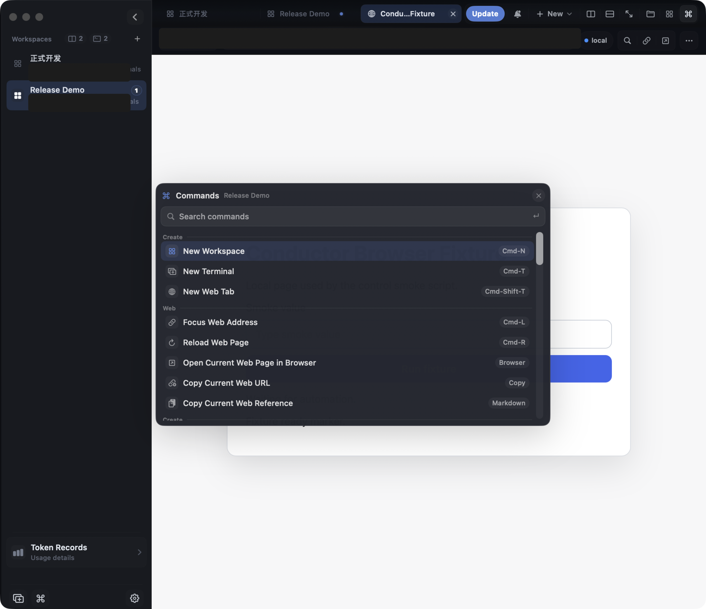

# Conductor

Native macOS workbench for terminal-heavy development.


Conductor brings terminals, web tabs, files, command actions, notifications, usage insight, local service awareness, and runtime updates into one compact desktop workspace.

[Install](#install) ·
[Quick start](#quick-start) ·
[Screenshots](#screenshots) ·
[Features](#features) ·
[Docs by goal](#docs-by-goal) ·
[Contributing](#contributing) ·
[Releases](https://github.com/zhengzizhe/conductor/releases)


## Features

Conductor is for local development sessions where terminal panes, browser references, files, notifications, and update tooling need to stay close without turning the whole screen into a dashboard.

- Native terminal workspaces with tabs, splits, pane movement, zoom, and command actions.
- Lightweight web tabs for docs, dashboards, local apps, and quick references.
- File manager and preview surfaces for staying close to the current project.
- Notification and command panels for common workspace actions.
- Usage records, local storage insight, service status, local dev-server links, and quick maintenance controls.
- Polished settings for appearance, terminal behavior, startup/proxy, notifications, shortcuts, themes, and updates.
- GitHub Release powered runtime updates with checksum verification.

## What Users Get

- **Less context loss:** workspaces, terminal layout, browser tabs, file tabs, appearance, and sidecar terminal snapshots are persisted locally.
- **A scriptable workbench:** the local control API can create workspaces, split panes, send terminal input, open web tabs, run commands, and create in-app attention events.
- **Attention that points somewhere:** notifications are stored in-app with workspace and surface context, so a missed macOS banner is not the only evidence.
- **Project state at a glance:** workspace rows and inspectors expose path, open files, web tabs, unread work, and local services without making users read every terminal.
- **A quieter update flow:** normal update UI focuses on available, downloading, ready, and failed states instead of exposing release internals.
- **Better troubleshooting:** diagnostics expose app, protocol, session, update, and notification state for bug reports.

## Install

Download the latest release, unzip it, and move `Conductor.app` to `/Applications`.

```text
https://github.com/zhengzizhe/conductor/releases/latest
```

> Conductor is currently a public preview. Builds are ad-hoc signed unless a release explicitly says otherwise, so macOS may ask you to confirm the first launch.

## Quick Start

Build and run from source:

```bash
git clone https://github.com/zhengzizhe/conductor.git
cd conductor/Apps/Conductor
./Scripts/prepare-ghosttykit.sh
swift build
swift run ConductorModelCheck
./Scripts/run-conductor.sh
```

Build a clickable app bundle:

```bash
cd Apps/Conductor
./Scripts/build-app-bundle.sh
open .build/Conductor.app
```

## Project Layout

```text
Apps/Conductor/           macOS application, scripts, updater, and UI
Apps/Conductor/Sources/   Swift source modules
Apps/Conductor/Scripts/   build, validation, release, and updater packaging scripts
docs/                     architecture, update, security, and planning notes
ThirdParty/               imported third-party source used by app features
```

## Screenshots

Generated from the current macOS build with `Apps/Conductor/Scripts/capture-release-screenshots.sh`.

### Workbench


### Usage Records


### Notifications



### Browser Surface



### Command Palette



### Settings


## Docs By Goal

| Goal | Start here |
| --- | --- |
| Run the app locally | [Getting started](docs/getting-started.md) |
| Script the app | [Local control API](docs/api.md) |
| Understand notifications | [Notifications](docs/notifications.md) |
| Understand restore behavior | [Session restore](docs/session-restore.md) |
| Ship a GitHub Release update | [Updating Conductor](docs/updating.md) |
| Understand runtime replacement safety | [Security model](docs/security.md) |
| Troubleshoot install/update/notification issues | [Troubleshooting](docs/troubleshooting.md) |
| Work on shell, panes, web tabs, and UI | [Architecture notes](docs/architecture.md) |
| Review active planning docs | [Superpower plans](docs/superpowers/plans) |
| Review design specs | [Superpower specs](docs/superpowers/specs) |

## Runtime Updates

Conductor checks GitHub Releases, compares the latest available build with the local app version, verifies the downloaded package, and stages replacement through an external installer after the app exits.

For maintainer release asset details, see [Updating Conductor](docs/updating.md). The app downloads the selected package, verifies its SHA-256 checksum, stages the update, then lets an external installer replace the app after Conductor exits.

## Current Preview Limits

- Browser tabs support navigation, snapshots, screenshots, DOM actions, typed waits, downloads, runtime-error diagnostics, and same-origin frame automation; cross-origin action routing and richer user-facing automation error UI are still under active development.
- Session restore preserves layout, browser/file tabs, snapshots, and restore-health diagnostics, but full journal replay and process reattachment are not complete yet.
- Native macOS notifications, targetable attention events, unread badges, toast fallback, and focus actions are available; broader permission-state test coverage is still being expanded.
- Workspace intelligence exposes project metadata and local service summaries; real-agent resume context and richer per-tab file/editor state are still being built.
- Public preview builds may be ad-hoc signed. See [Security model](docs/security.md) and [Troubleshooting](docs/troubleshooting.md).

## Security Defaults

- Update packages must match the SHA-256 in release metadata.
- The staged app must match the expected bundle identifier.
- The staged app must pass `codesign --verify --deep --strict`.
- Runtime replacement happens from an external installer after Conductor exits.

## Release

Create versioned full/delta artifacts and GitHub updater metadata from `Apps/Conductor`:

```bash
CONDUCTOR_GITHUB_REPO=owner/repo \
./Scripts/package-release.sh 0.0.3 3
```

Publish the generated assets:

```bash
CONDUCTOR_GITHUB_REPO=owner/repo \
./Scripts/publish-github-release.sh \
../../Artifacts/releases/0.0.3-3-macos-arm64 v0.0.3
```

For signed production builds:

```bash
CONDUCTOR_BUNDLE_IDENTIFIER=com.example.conductor \
CONDUCTOR_CODE_SIGN_IDENTITY="Developer ID Application: Example" \
CONDUCTOR_GITHUB_REPO=owner/repo \
./Scripts/package-release.sh 0.0.3 3
```

## Validation

```bash
cd Apps/Conductor
swift run ConductorModelCheck
./Scripts/check-conductor.sh
```

The automated gate verifies core workspace invariants, smoke-runs the app, checks the local update fixture, and captures release screenshots without touching persisted user state.

## Contributing

Issues are open for bug reports, crash reports, usability feedback, and feature requests. Pull requests are welcome, but please keep changes focused and include validation notes.

The default branch is `main` and is protected. Direct write access is limited to the owner account; external contributions should go through forks and pull requests.

Useful links:

- [Issues](https://github.com/zhengzizhe/conductor/issues)
- [Releases](https://github.com/zhengzizhe/conductor/releases)
- [Pulse](https://github.com/zhengzizhe/conductor/pulse)
- [Contributors](https://github.com/zhengzizhe/conductor/graphs/contributors)
