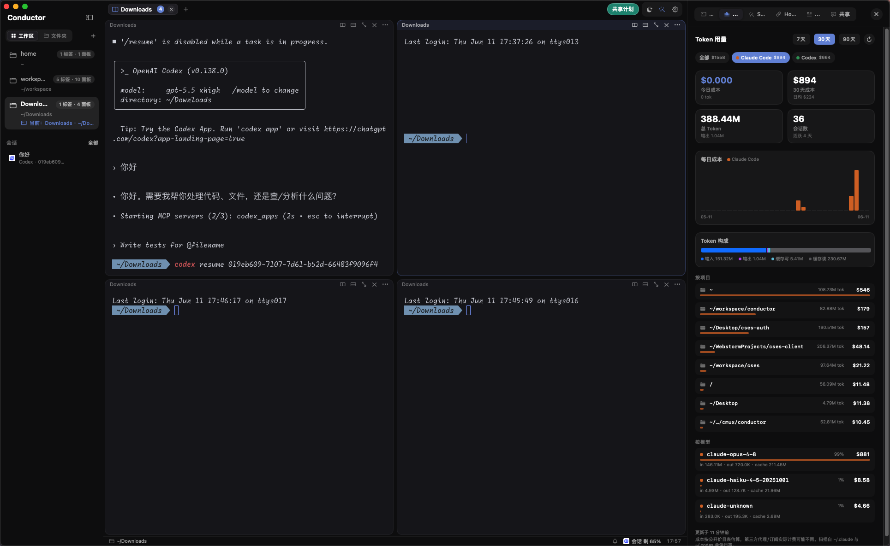

# Conductor

Conductor 是一个 macOS 多 Agent 终端工作台，用来同时跑 Codex、Claude Code 和普通 shell。

它不是聊天壳，也不是把终端截图塞进网页里。Conductor 把工作区、会话、多个真实终端 pane、待处理状态和 Token 用量放在同一个原生 macOS 窗口里，适合一边让 agent 并行处理任务，一边随时接管终端。

[官网](https://zhengzizhe.github.io/conductor/) · [下载最新版](https://github.com/zhengzizhe/conductor/releases/latest)



## 适合什么场景

- 同时开多个 Codex / Claude Code / shell，会话和窗口不想散得到处都是。
- 一个项目里需要并行跑修复、审查、构建、测试，又希望随时能切进任意终端接管。
- 想知道最近 Token 和成本花在哪些项目、哪些模型上。
- 经常需要恢复目录、分屏布局、最近会话和误关的 pane。

## 核心能力

- **真实终端 pane**：每个分屏都是 libghostty surface，GPU 渲染 + PTY，不是伪终端。
- **工作区侧栏**：按目录管理工作区，左侧显示当前目录、pane 数量和最近会话。
- **自由分屏**：tab 内水平/竖直分屏，可拖分隔条调大小；`⌘ + 拖动` pane 可重排。
- **会话续聊**：关闭/退出时记录 Claude / Codex 会话 ID，恢复 pane 时预填 `claude --resume <id>` / `codex resume <id>`。
- **误关恢复**：`⌘⇧T` 恢复最近关闭的 tab / pane，带回目录、分屏位置和关闭前终端内容。
- **任务队列**：给当前 pane 排队下一条指令，上一轮结束后继续执行。
- **待处理状态**：权限确认、agent 提问、完成未读等状态集中提示，不用轮流点开每个终端检查。
- **Token 用量**：扫描 `~/.claude/projects` 与 `~/.codex/sessions`，按时间、项目、模型和 token 构成展示成本。
- **工具面板**：检测 Codex / Claude / Gemini / Cursor / Copilot / Grok，管理 Skills、Hooks、命令片段和共享计划。

## 下载

从 [Releases](https://github.com/zhengzizhe/conductor/releases/latest) 下载对应芯片的 DMG：

- Apple Silicon：`arm64.dmg`
- Intel：`x86_64.dmg`

发布包优先使用稳定代码签名，避免 macOS 把每次更新都当成新 App 而反复要求权限。首次打开如被 macOS 拦截，可以右键 App 选择“打开”，或执行：

```bash
xattr -dr com.apple.quarantine /Applications/Conductor.app
```

本地开发打包前建议先运行一次 `Scripts/make-dev-cert.sh`，再运行 `Scripts/make-app.sh` 或 `Scripts/make-dmg.sh`。这样桌面/文稿/下载、完全磁盘访问和通知授权会跟随稳定签名保留。

## 构建与运行

需要 macOS 14+ 与 Xcode / Swift 工具链。

```bash
# 1. 拉取预编译的 GhosttyKit.xcframework（约 536MB，不入 git）
./Scripts/prepare-ghosttykit.sh

# 2. 一次性创建稳定开发签名，然后打包运行
./Scripts/make-dev-cert.sh
./Scripts/make-app.sh
open ./Conductor.app
```

`swift test` 运行 ConductorCore 和 ConductorApp 的单元测试。

快速调试也可以用 `swift run ConductorApp`，但裸可执行不具备稳定 App 签名身份，macOS 权限授权不如打包后的 `Conductor.app` 稳定。

### CLI / Socket 控制

Conductor 启动后会监听本机 Unix socket：`~/Library/Application Support/conductor/automation.sock`。开发环境可直接运行：

```bash
swift run conductorctl ping
swift run conductorctl pane list
swift run conductorctl workspace tree --json
swift run conductorctl pane split --direction down --cwd "$PWD"
swift run conductorctl screen --scrollback
swift run conductorctl run codex --cwd "$PWD" --prompt "检查当前改动" --wait
printf '检查当前改动\n重点看测试缺口\n' | swift run conductorctl run codex --stdin --wait
swift run conductorctl agent wait p123 --json
swift run conductorctl events --jsonl
```

workspace / tab / pane / status / progress / log 都有正式子命令；完整列表见 `swift run conductorctl --help`。

打包后的 CLI 位于 `Conductor.app/Contents/MacOS/conductorctl`，例如：

```bash
/Applications/Conductor.app/Contents/MacOS/conductorctl activity --limit 10
```

批量自动化可走 NDJSON，每行一个 `{"id":1,"method":"app.status","params":{...}}` 请求：

```bash
printf '{"id":1,"method":"app.ping"}\n{"id":2,"method":"pane.list"}\n' \
  | swift run conductorctl batch
```

需要给非 Unix-socket 客户端接入时，可以启动本机 HTTP/WebSocket bridge：

```bash
swift run conductorctl bridge --host 127.0.0.1 --port 17373
```

bridge 提供 `POST /rpc`、`POST /batch`、`GET /methods`、`GET /openapi.json`、`WS /rpc`、`WS /events` 和 `GET /events` SSE。HTTP 接口支持 CORS/OPTIONS；`/events` 支持 `limit` 与 `interval` 查询参数。

CLI / socket / bridge 的脚本化回归测试：

```bash
./Scripts/test-conductorctl.sh
```

### 打包成 .app

系统通知、bundle id 和部分 macOS 集成需要用打包后的 `Conductor.app` 运行，而不是 `swift run`：

```bash
./Scripts/make-dev-cert.sh
./Scripts/make-app.sh
open ./Conductor.app
```

首次运行后，可以在右侧工具面板的 CLI / Hooks 区域安装完成通知 hook。安装后 agent 完成、等待确认或需要关注时，会通过 conductor 的 pane id 跳回对应终端。

如果系统拦截通知，到“系统设置 › 通知 › Conductor”手动开启即可。未授权时会回退为普通通知横幅。

## 快捷键

| 键 | 作用 |
|---|---|
| `⌘T` | 新建 tab |
| `⌘D` / `⌘⇧D` | 向右竖分 / 向下横分 |
| `⌘W` | 关闭当前 pane，最后一个 pane 会关闭 tab |
| `⌘⇧T` | 恢复最近关闭的 tab / pane |
| `⌘⌥← / →` | 在分屏间切换焦点 |
| `⌘⇧M` | 打开任务总览 |
| `⌘⇧⏎` | 打开当前 pane 的任务队列 |
| `⌘/` | 键位速查 |
| `⌘ + 拖动终端` | 把该 pane 拖到别处重排 |

## 共享计划

右上角“共享计划”用来收集真实工作流：哪里卡住、现在怎么绕、希望改成什么样、能否提供截图/日志/配置/PR。

不用写完整方案。真实场景和取舍比口号更有用。

## 架构

- **`ConductorCore`**：纯 Swift 库，包含数据模型、分屏树、命令 reducer、`SessionRegistry`、持久化和引擎无关的 `TerminalSurface` 协议。
- **`ConductorApp`**：SwiftUI 外壳 + AppKit 终端区；`AppCoordinator` 管理状态和命令；`GhosttySurface` 封装 libghostty。
- **GhosttyKit**：预编译的 libghostty C API，以 binary target 方式链接。
- **GitHub Pages**：静态页面在 `site/`，由 `.github/workflows/pages.yml` 部署。

## 渲染注意

libghostty 终端视图基于 `CAMetalLayer`。终端容器里不能放非 Metal 的 layer-backed 兄弟视图，父级也不能重写 `draw()`，否则可能破坏 Metal 呈现导致非聚焦 pane 白屏。

因此 pane 容器只承载终端视图本身，焦点环和 chrome 另行处理。

## 贡献者

- [tobemonkey](https://github.com/tobemonkey)（demoy）—— 提供可配置 AI 会话类型、工作区右键创建 AI 会话和 tab 加号悬浮菜单。

## 友情链接

- [LINUX DO](https://linux.do/) —— 新的理想型社区，技术爱好者的聚集地。
