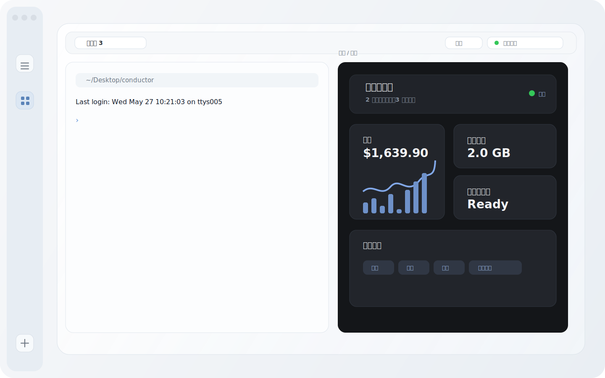
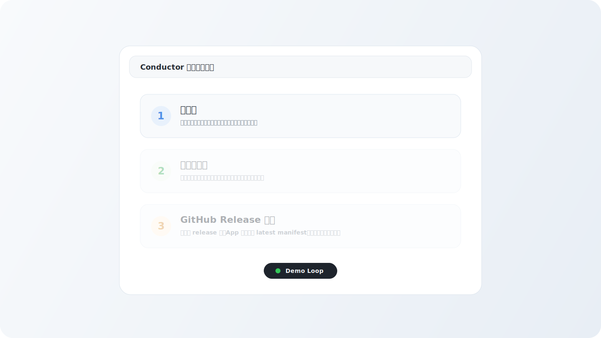
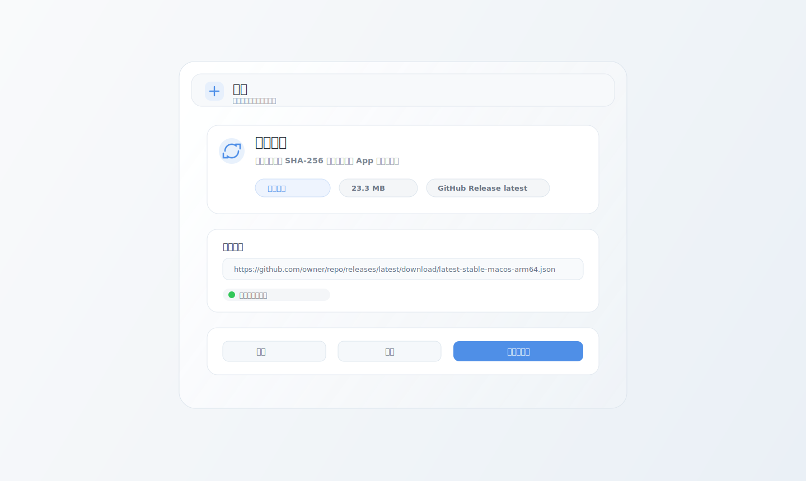
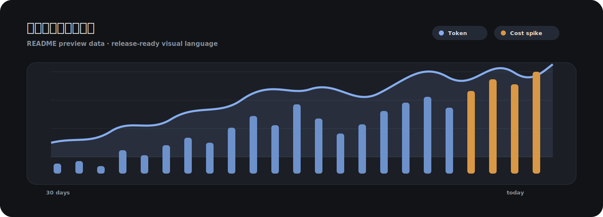

# Conductor

Native macOS workspace for terminals, web tabs, files, usage insight, and self-updating releases.



## What It Is

Conductor is a focused desktop workbench for development sessions. It keeps terminal panes, browser tabs, file context, command actions, usage records, and runtime updates in one native macOS shell.

The current build is optimized for a release-ready feel: compact chrome, draggable floating panels, custom themes, editable shortcuts, polished settings, and a GitHub Release powered updater.

## Highlights

- Native multi-terminal workspace with panes, tabs, drag/drop tab movement, zoom, file manager, and command palette.
- Web tabs for quick authenticated research and reference pages without leaving the workspace.
- Usage workbench with local records, service health, storage cleanup hints, cost summaries, and quick actions.
- Settings system for appearance, terminal behavior, startup/proxy, notifications, shortcuts, themes, and updates.
- In-app runtime updater that reads a GitHub Release manifest, downloads full or incremental packages, verifies SHA-256, replaces the app, and relaunches.
- Release tooling for version bumps, full packages, file-level delta packages, latest manifests, and GitHub Release publishing.

## Demo Loop



## Runtime Updates

The app can check GitHub Releases directly. A release publishes:

- `Conductor-<version>-<build>-macos-<arch>.zip`
- optional `Conductor-<version>-<build>-from-previous-macos-<arch>.delta.zip`
- `latest-stable-macos-<arch>.json`

Conductor reads:

```text
https://github.com/owner/repo/releases/latest/download/latest-stable-macos-arm64.json
```

Then it compares versions, downloads the preferred package, verifies the checksum, and runs a small external installer so the app can replace itself safely after quitting.



## Usage Trend



## Build

```bash
cd Apps/Conductor
./Scripts/prepare-ghosttykit.sh
swift build
swift run ConductorModelCheck
```

Run locally:

```bash
./Scripts/run-conductor.sh
```

Create a clickable app bundle:

```bash
./Scripts/build-app-bundle.sh
open .build/Conductor.app
```

## Release

Set the GitHub repo once per release build:

```bash
CONDUCTOR_GITHUB_REPO=owner/repo \
Apps/Conductor/Scripts/package-release.sh 2026052701
```

Publish the generated assets:

```bash
Apps/Conductor/Scripts/publish-github-release.sh \
Artifacts/releases/0.1.1-2026052701-macos-arm64
```

For signed production builds:

```bash
CONDUCTOR_BUNDLE_IDENTIFIER=com.example.conductor \
CONDUCTOR_CODE_SIGN_IDENTITY="Developer ID Application: Example" \
CONDUCTOR_GITHUB_REPO=owner/repo \
Apps/Conductor/Scripts/package-release.sh 2026052701
```

## Validation

```bash
cd Apps/Conductor
swift run ConductorModelCheck
./Scripts/check-conductor.sh
```

The automated gate verifies core workspace invariants and smoke-runs the app without touching persisted user state.

## Repository Policy

This repository is private. The default branch is `main`; release assets are published through GitHub Releases. Direct write access should stay limited to the owner account.
