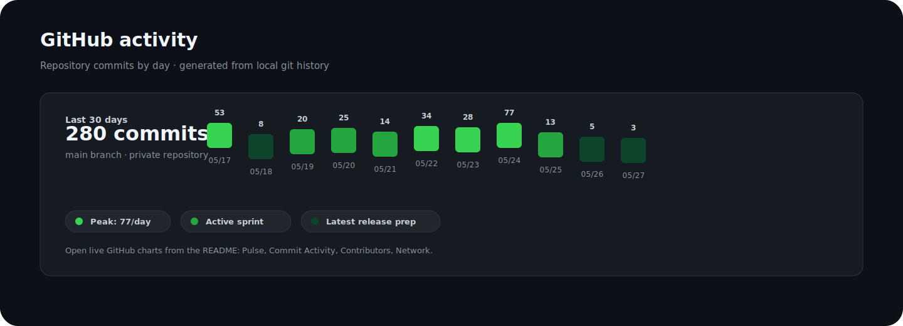

# Conductor

Native macOS workbench for terminal-heavy development sessions.


Conductor brings terminals, web tabs, files, command actions, usage insight, and GitHub Release powered runtime updates into one compact desktop workspace.

> Private release candidate. Default branch: [`main`](https://github.com/zhengzizhe/conductor/tree/main).

[Install](#install) ·
[Quick start](#quick-start) ·
[Screenshots](#screenshots) ·
[Docs by goal](#docs-by-goal) ·
[Updating](#runtime-updates) ·
[GitHub activity](#github-activity) ·
[Releases](https://github.com/zhengzizhe/conductor/releases)


## Why Conductor

Conductor is for local development sessions where terminal panes, browser references, files, notifications, and release tooling need to stay close without turning the whole screen into a dashboard.

- **Native workspace:** terminal panes, tabs, split movement, zoom, command palette, file manager, and notifications.
- **Web where it belongs:** lightweight web tabs for docs, dashboards, and quick authenticated references.
- **Usage workbench:** local records, service health, storage cleanup hints, token/cost summaries, and quick actions.
- **Polished settings:** appearance, terminal behavior, startup/proxy, notifications, shortcuts, themes, and updates.
- **Self-updating runtime:** GitHub Release manifest, full/delta packages, SHA-256 verification, app replacement, and relaunch.

## Install

Release builds are distributed through GitHub Releases.

```text
https://github.com/zhengzizhe/conductor/releases/latest
```

Download the latest `Conductor-<version>-<build>-macos-<arch>.zip`, unzip it, and move `Conductor.app` to `/Applications`.

> The repo is private during the release-candidate phase, so releases require repository access.

## Quick Start

```bash
git clone https://github.com/zhengzizhe/conductor.git
cd conductor/Apps/Conductor
./Scripts/prepare-ghosttykit.sh
swift build
swift run ConductorModelCheck
./Scripts/run-conductor.sh
```

Build a clickable app bundle:

```bash
cd Apps/Conductor
./Scripts/build-app-bundle.sh
open .build/Conductor.app
```

## Screenshots


## Demo


## Docs By Goal

| Goal | Start here |
| --- | --- |
| Run the app locally | [Getting started](docs/getting-started.md) |
| Ship a GitHub Release update | [Updating Conductor](docs/updating.md) |
| Understand runtime replacement safety | [Security model](docs/security.md) |
| Work on shell, panes, web tabs, and UI | [Architecture notes](docs/architecture.md) |
| Review active planning docs | [Superpower plans](docs/superpowers/plans) |
| Review design specs | [Superpower specs](docs/superpowers/specs) |

## Runtime Updates

Conductor can check GitHub Releases directly. A release publishes:

- `Conductor-<version>-<build>-macos-<arch>.zip`
- optional `Conductor-<version>-<build>-from-previous-macos-<arch>.delta.zip`
- `latest-stable-macos-<arch>.json`

The app reads the stable latest manifest:

```text
https://github.com/owner/repo/releases/latest/download/latest-stable-macos-arm64.json
```

Then it compares versions, downloads the preferred package, verifies the checksum, and runs an external installer so the app can replace itself safely after quitting.

## Security Defaults

- Update packages must match the SHA-256 in the manifest.
- The staged app must match the expected bundle identifier.
- The staged app must pass `codesign --verify --deep --strict`.
- Runtime replacement happens from an external installer after Conductor exits.
- Repository write access should stay limited to the owner account.

## GitHub Activity

[](https://www.star-history.com/#zhengzizhe/conductor&Date)

> Star History appears once the repository is visible to the chart service. For private development, use GitHub Insights directly.



- [Pulse](https://github.com/zhengzizhe/conductor/pulse) for recent merged work and issue activity.
- [Commit Activity](https://github.com/zhengzizhe/conductor/graphs/commit-activity) for weekly commit trends.
- [Contributors](https://github.com/zhengzizhe/conductor/graphs/contributors) for contribution distribution.
- [Network](https://github.com/zhengzizhe/conductor/network) for branch/fork topology.

## Release

Create versioned full/delta artifacts and GitHub updater manifests:

```bash
CONDUCTOR_GITHUB_REPO=owner/repo \
Apps/Conductor/Scripts/package-release.sh 2026052701
```

Publish the generated assets:

```bash
Apps/Conductor/Scripts/publish-github-release.sh \
Artifacts/releases/0.1.1-2026052701-macos-arm64
```

For signed production builds:

```bash
CONDUCTOR_BUNDLE_IDENTIFIER=com.example.conductor \
CONDUCTOR_CODE_SIGN_IDENTITY="Developer ID Application: Example" \
CONDUCTOR_GITHUB_REPO=owner/repo \
Apps/Conductor/Scripts/package-release.sh 2026052701
```

## Validation

```bash
cd Apps/Conductor
swift run ConductorModelCheck
./Scripts/check-conductor.sh
```

The automated gate verifies core workspace invariants and smoke-runs the app without touching persisted user state.

## Repository Policy

This repository is private. The default branch is `main`; release assets are published through GitHub Releases. Direct write access should stay limited to the owner account.
