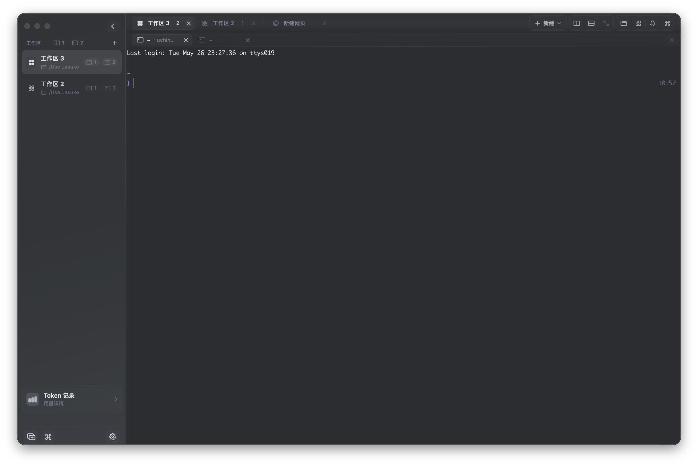
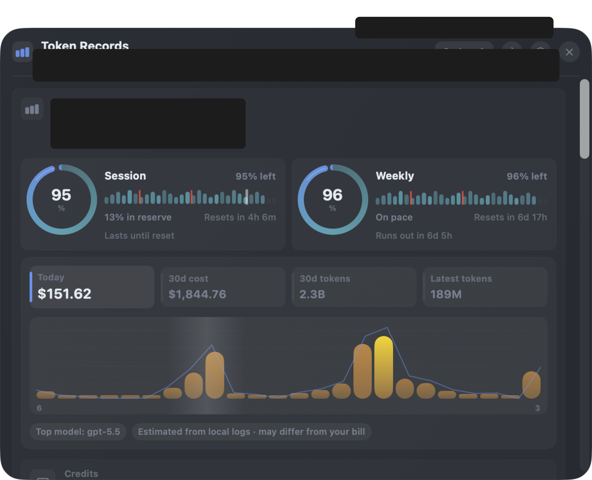
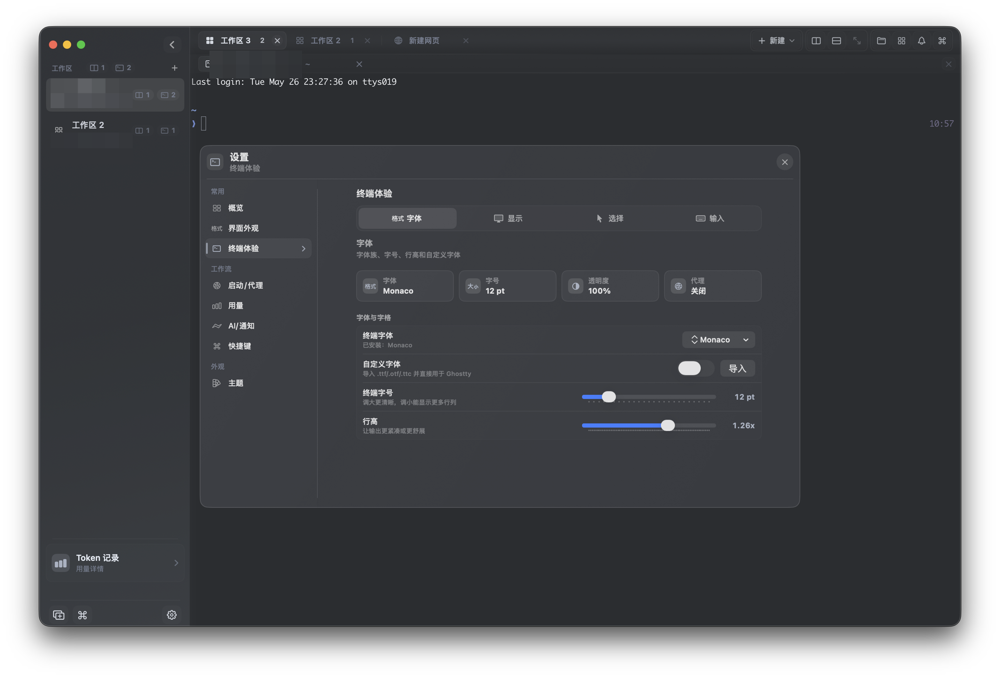

# Conductor

Native macOS workbench for terminal-heavy development.


Conductor brings terminals, web tabs, files, command actions, notifications, usage insight, and runtime updates into one compact desktop workspace.

[Install](#install) ·
[Quick start](#quick-start) ·
[Screenshots](#screenshots) ·
[Features](#features) ·
[Docs by goal](#docs-by-goal) ·
[Contributing](#contributing) ·
[Releases](https://github.com/zhengzizhe/conductor/releases)



## Features

Conductor is for local development sessions where terminal panes, browser references, files, notifications, and update tooling need to stay close without turning the whole screen into a dashboard.

- Native terminal workspaces with tabs, splits, pane movement, zoom, and command actions.
- Lightweight web tabs for docs, dashboards, and quick references.
- File manager and preview surfaces for staying close to the current project.
- Notification and command panels for common workspace actions.
- Usage records, local storage insight, service status, and quick maintenance controls.
- Polished settings for appearance, terminal behavior, startup/proxy, notifications, shortcuts, themes, and updates.
- GitHub Release powered runtime updates with checksum verification.

## Install

Download the latest release, unzip it, and move `Conductor.app` to `/Applications`.

```text
https://github.com/zhengzizhe/conductor/releases/latest
```

The app checks the public GitHub Release manifest for updates:

```text
https://github.com/zhengzizhe/conductor/releases/latest/download/latest-stable-macos-arm64.json
```

> Conductor is currently a public preview. Builds are ad-hoc signed unless a release explicitly says otherwise, so macOS may ask you to confirm the first launch.

## Quick Start

Build and run from source:

```bash
git clone https://github.com/zhengzizhe/conductor.git
cd conductor/Apps/Conductor
./Scripts/prepare-ghosttykit.sh
swift build
swift run ConductorModelCheck
./Scripts/run-conductor.sh
```

Build a clickable app bundle:

```bash
cd Apps/Conductor
./Scripts/build-app-bundle.sh
open .build/Conductor.app
```

## Project Layout

```text
Apps/Conductor/           macOS application, scripts, updater, and UI
Apps/Conductor/Sources/   Swift source modules
Apps/Conductor/Scripts/   build, validation, release, and updater packaging scripts
docs/                     architecture, update, security, and planning notes
ThirdParty/               imported third-party source used by app features
```

## Screenshots

Captured from the current macOS build.

### Usage Records



### Settings



## Docs By Goal

| Goal | Start here |
| --- | --- |
| Run the app locally | [Getting started](docs/getting-started.md) |
| Ship a GitHub Release update | [Updating Conductor](docs/updating.md) |
| Understand runtime replacement safety | [Security model](docs/security.md) |
| Work on shell, panes, web tabs, and UI | [Architecture notes](docs/architecture.md) |
| Review active planning docs | [Superpower plans](docs/superpowers/plans) |
| Review design specs | [Superpower specs](docs/superpowers/specs) |

## Runtime Updates

Conductor checks a public GitHub Release manifest and compares it with the local app version. A release publishes:

- `Conductor-<version>-<build>-macos-<arch>.zip`
- optional `Conductor-<version>-<build>-from-previous-macos-<arch>.delta.zip`
- `latest-stable-macos-<arch>.json`

The app downloads the selected package, verifies its SHA-256 checksum, stages the update, then lets an external installer replace the app after Conductor exits.

## Security Defaults

- Update packages must match the SHA-256 in the manifest.
- The staged app must match the expected bundle identifier.
- The staged app must pass `codesign --verify --deep --strict`.
- Runtime replacement happens from an external installer after Conductor exits.

## Release

Create versioned full/delta artifacts and GitHub updater manifests from `Apps/Conductor`:

```bash
CONDUCTOR_GITHUB_REPO=owner/repo \
./Scripts/package-release.sh 0.0.3 3
```

Publish the generated assets:

```bash
CONDUCTOR_GITHUB_REPO=owner/repo \
./Scripts/publish-github-release.sh \
../../Artifacts/releases/0.0.3-3-macos-arm64 v0.0.3
```

For signed production builds:

```bash
CONDUCTOR_BUNDLE_IDENTIFIER=com.example.conductor \
CONDUCTOR_CODE_SIGN_IDENTITY="Developer ID Application: Example" \
CONDUCTOR_GITHUB_REPO=owner/repo \
./Scripts/package-release.sh 0.0.3 3
```

## Validation

```bash
cd Apps/Conductor
swift run ConductorModelCheck
./Scripts/check-conductor.sh
```

The automated gate verifies core workspace invariants and smoke-runs the app without touching persisted user state.

## Contributing

Issues are open for bug reports, crash reports, usability feedback, and feature requests. Pull requests are welcome, but please keep changes focused and include validation notes.

The default branch is `main` and is protected. Direct write access is limited to the owner account; external contributions should go through forks and pull requests.

Useful links:

- [Issues](https://github.com/zhengzizhe/conductor/issues)
- [Releases](https://github.com/zhengzizhe/conductor/releases)
- [Pulse](https://github.com/zhengzizhe/conductor/pulse)
- [Commit Activity](https://github.com/zhengzizhe/conductor/graphs/commit-activity)
- [Contributors](https://github.com/zhengzizhe/conductor/graphs/contributors)

## GitHub Activity

[](https://www.star-history.com/#zhengzizhe/conductor&Date)


