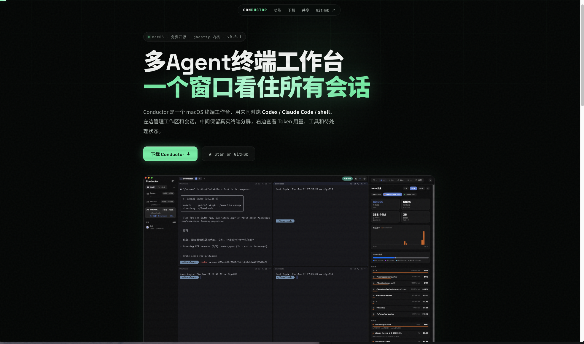
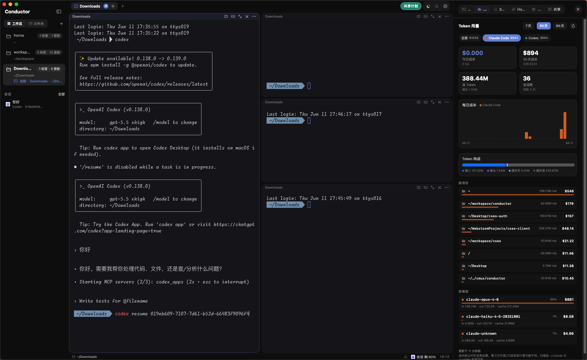
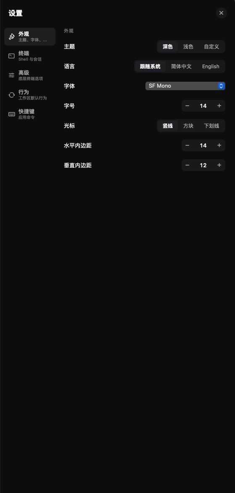

# 我开源了一个多终端工具：Conductor

我开源了一个多终端工具，叫 **Conductor**。

它是一个 macOS 上的多 Agent 终端工作台，用来同时跑 Codex、Claude Code 和普通 shell。简单说，就是把工作区、多个终端 pane、会话记录、待处理状态和 Token 用量放进一个窗口里。

项目地址：

- GitHub: https://github.com/zhengzizhe/conductor
- 官网: https://zhengzizhe.github.io/conductor/
- 下载: https://github.com/zhengzizhe/conductor/releases/latest



## 为什么做这个

我现在写代码时，经常不是只开一个终端。

一个 pane 里跑 Codex，让它改代码；另一个 pane 里跑 Claude Code，让它看方案；旁边还要有 shell 用来跑测试、看日志、查文件。任务多的时候，真正麻烦的不是“能不能启动一个 agent”，而是这些问题：

- 哪个 agent 还在跑？
- 哪个已经卡住，等我确认权限或回答问题？
- 刚才那个会话在哪个目录里？
- 这个项目这几天到底花了多少 token？
- 我关掉的终端还能不能恢复？
- 我想同时看几个任务，能不能别散成一堆窗口？

所以我做了 Conductor。

它不是聊天产品，也不是一个漂亮的网页壳。它的目标更朴素：**把多 Agent 开发时的终端工作流整理好**。

## 它现在长这样



左侧是工作区和会话，按目录组织。

中间是多个真实终端 pane，可以跑 Codex、Claude Code 或普通 shell。每个 pane 都是 libghostty surface，不是自己画的假终端。

右侧是工具面板。现在已经有 Token 用量、CLI 检测、Skills、Hooks、命令片段和共享计划。

设置面板也是应用内的，不单独弹一个系统偏好窗口：



## 目前能做什么

### 1. 多 pane 真实终端

Conductor 的核心还是终端。

每个分屏都是一个真实 PTY + libghostty 渲染面，可以正常运行 Codex、Claude Code、zsh、构建命令、测试命令。

你可以横向 / 纵向分屏，也可以拖动分隔条调整大小。需要重排时，按住 `⌘` 拖动一个 pane 到另一个 pane 上，就能把它移过去。

### 2. 工作区和会话管理

左侧栏按目录管理工作区。一个项目对应一个工作区，里面可以有多个 tab 和多个 pane。

如果某个 pane 里跑过 Codex / Claude Code，Conductor 会记录最近会话。下次恢复时，会把 `codex resume <id>` 或 `claude --resume <id>` 预填到终端里，按 Enter 就能接着聊。

这样你不用再去翻历史命令，也不用记刚才那个 agent 会话 ID。

### 3. 误关恢复

`⌘⇧T` 可以恢复最近关闭的 tab / pane。

恢复时会尽量带回：

- 原来的目录
- 原来的分屏位置
- 关闭前的终端内容快照
- 对应的 agent 会话续聊命令

这对多任务开发很有用。因为很多时候不是“我想关掉”，只是手滑，或者临时清理窗口后又想找回来。

### 4. 待处理状态

Agent 经常会卡在一些需要人工处理的地方，比如：

- 要不要运行某个命令
- 要不要改某个文件
- 需要你补充信息
- 已经完成但你还没看

Conductor 会把这些状态集中显示，不需要你一个个终端点进去看它到底是不是还在跑。

### 5. Token 用量

右侧用量面板会扫描本机的 Claude / Codex 会话记录，按时间、项目、模型和 token 构成统计。

我做这个主要是因为多 agent 并行以后，成本会变得很不直观。

一次探索到底花了多少 token？哪个目录花得最多？最近 30 天主要是 Claude Code 还是 Codex 在消耗？这些东西如果只靠账单，很难和具体项目对应起来。

### 6. Hooks / Skills / CLI 工具

工具面板里还有几个实用功能：

- 检测本机 Codex / Claude / Gemini / Cursor / Copilot / Grok 是否可用
- 管理 Claude / Codex / Cursor 的 `SKILL.md`
- 安装完成通知、提示音、横幅、完成日志等 hooks
- 管理常用命令片段

Hooks 这块会尽量保留你原来的配置，只加 conductor 需要的命令。

## 快捷键

常用快捷键如下：

| 快捷键 | 作用 |
|---|---|
| `⌘T` | 新建 tab |
| `⌘D` / `⌘⇧D` | 向右竖分 / 向下横分 |
| `⌘W` | 关闭当前 pane |
| `⌘⇧T` | 恢复最近关闭的 tab / pane |
| `⌘⌥← / →` | 在分屏间切换焦点 |
| `⌘⇧M` | 打开任务总览 |
| `⌘⇧⏎` | 打开当前 pane 的任务队列 |
| `⌘/` | 键位速查 |

## 技术实现

Conductor 是 Swift / SwiftUI / AppKit 写的原生 macOS 应用。

大概分三层：

- `ConductorCore`：纯 Swift 的模型层，包含工作区、tab、分屏树、状态持久化和命令 reducer。
- `ConductorApp`：SwiftUI 外壳和 AppKit 终端区域。
- `GhosttyKit`：预编译的 libghostty C API，用来承载真实终端渲染。

这里有一个比较重要的坑：libghostty 的终端视图基于 `CAMetalLayer`。终端容器里不能随便叠普通 layer-backed view，否则可能出现非聚焦 pane 白屏。所以 pane 的 chrome、焦点环和终端内容需要拆开处理。

## 当前状态

项目还在早期阶段，但已经可以作为日常工具试用。

现在我最关心的不是再堆一堆听起来很酷的功能，而是收集真实工作流：

- 你会同时跑几个 agent？
- 哪些状态最容易漏掉？
- 会话恢复怎样才算顺手？
- Token 成本应该怎么归因？
- 哪些 hooks 真正能减少来回切窗口？

所以应用右上角有一个“共享计划”。如果你试了 Conductor，可以直接在那里提交使用场景、问题、截图、日志或 PR。

不用写完整方案。真实场景比口号更有用。

## 下载和试用

可以直接从 Releases 下载：

https://github.com/zhengzizhe/conductor/releases/latest

发布包优先使用稳定代码签名，避免 macOS 把每次更新都当成新 App 而反复要求权限。第一次打开如果仍被 macOS 拦一下，可以右键 App 选择“打开”，或者执行：

```bash
xattr -dr com.apple.quarantine /Applications/Conductor.app
```

如果你更想从源码跑：

```bash
./Scripts/prepare-ghosttykit.sh
./Scripts/make-dev-cert.sh
./Scripts/make-app.sh
open ./Conductor.app
```

## 最后

如果你现在也在用 Codex / Claude Code 这类工具写代码，而且经常一开就是多个终端，那 Conductor 可能会适合你。

欢迎试用、提 issue、提 PR，也欢迎只发一个你真实工作流里的卡点。

GitHub:

https://github.com/zhengzizhe/conductor
